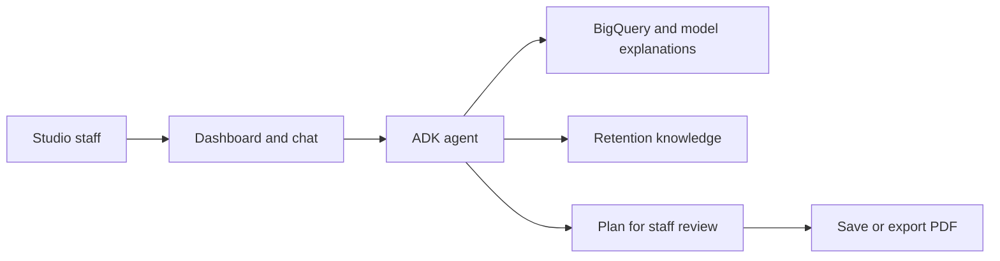

# ACISO Agent CRM

An AI-assisted customer retention prototype for fitness studios, built for my bachelor's thesis in Business Informatics with ACISO Consulting and ELEMENTS Fitness.

The application brings member-risk analysis and retention planning into one dashboard. Staff can inspect a risk score, ask the agent for supporting information and review a proposed follow-up plan.

## How it works

The Next.js frontend provides the dashboard and chat. A Python agent built with Google ADK queries BigQuery, retrieves model explanations and searches a retention knowledge corpus. Firebase handles sign-in and stored plans. Staff can review a recommendation, save it and export a PDF.



## Repository

```text
backend/                 Python service and agent tools
  aciso_agent/           Agent, prompts, queries and plan generation
  tests/                 Offline backend tests
frontend/                Next.js application
  app/                   Pages and API routes
  components/            Dashboard, chat and retention-plan views
  lib/                   Data access, cloud configuration and shared types
  tests/                 Unit tests, browser scenarios and fixtures
docs/                    Setup, architecture and source notes
scripts/                 Source export and its checks
```

## Read the code

| Area | Source |
| --- | --- |
| Agent behavior and tools | [Backend source map](backend/README.md) |
| Dashboard and chat | [Frontend source map](frontend/README.md) |
| Streamed agent responses | [API proxy](frontend/app/api/adk/route.ts) |
| Saved plans and PDF export | [Retention-plan routes](frontend/app/api/retention-plans/) |

Read the [project background](docs/case-study.md) and [architecture](docs/architecture.md).

## Run locally

You need a Firebase project, BigQuery tables with the expected member schema and a Vertex AI retrieval corpus. Both application folders contain an `.env.example`.

Follow the [setup instructions](docs/setup.md) to configure both services and run the offline checks. The backend uses port 8001 and the frontend uses port 3000 by default.

## Source edition

This is a maintained public edition of the thesis prototype, with later fixes and a reorganized source tree. Research datasets, credentials and private development history are excluded. Static dashboard examples use labeled synthetic data.

Offline tests, lint and type checking cover selected components. Running the complete application requires cloud configuration; some authorization and saved-plan paths retain development placeholders. The project does not claim a production rollout or a measured reduction in churn.

See the [source history](docs/source-notes.md) for release details and the [verification notes](docs/verification.md) for test results and remaining integration work.
