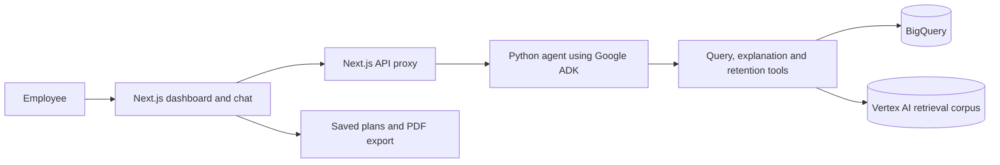

# Architecture and source map

## Where to read the implementation

| Behavior | Source |
| --- | --- |
| Agent definition and callbacks | `Aciso-Agent_Final/Aciso_Agent/agent.py` |
| Instructions and tool descriptions | `Aciso-Agent_Final/Aciso_Agent/instructions.py` |
| Queries, explanations and plan generation | `Aciso-Agent_Final/Aciso_Agent/tools.py` |
| Configuration and state | `Aciso-Agent_Final/Aciso_Agent/config.py`, `state.py` |
| PDF rendering | `Aciso-Agent_Final/Aciso_Agent/pdf_generator.py` |
| Streaming proxy | `ai-agent-fe/app/api/adk/route.ts` |
| Dashboard | `ai-agent-fe/app/(auth)/dashboard/` |
| Saved-plan endpoints | `ai-agent-fe/app/api/retention-plans/` |

The agent uses Gemini through Google ADK and Vertex AI. Project IDs, credential paths and the retrieval corpus are supplied through environment variables.

## Boundaries that matter

The metrics and analytics endpoints contain synthetic fixtures, and report paths include generated example values. Saved-plan views retain development user/token placeholders. These are integration gaps, not evidence of a working production data flow. The verification notes describe the tested scope.

The SQL tool includes syntax and table checks and query limits. These are not a complete authorization system. Agent callbacks include development behavior that allows tool execution. The backend has broad development CORS settings and fallback paths. Review these before deployment.

The existing backend tests cover configuration defaults and state models. Their SQL tests repeat a simplified keyword check; they do not exercise the complete production validator. A passing result must not be presented as a security audit.

The source exporter uses an allowlist, rejects symlinks and checks selected text for credential patterns. This is a packaging safeguard. It does not rotate credentials or remove content from the private repository's history.
